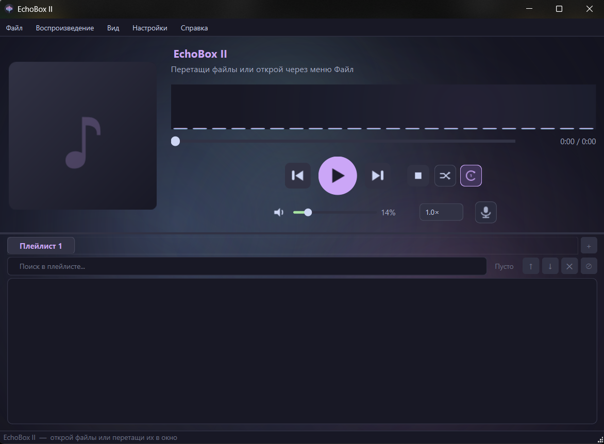

<h1 align="center">
  <br>
  🎵 EchoBox II
  <br>
</h1>

<h4 align="center">Современный музыкальный плеер на Qt 6 с визуализатором, Discord RPC и выводом музыки в микрофон</h4>

<p align="center">
  
  
  
  
  
</p>

<p align="center">
  <a href="#возможности">Возможности</a> •
  <a href="#скриншоты">Скриншоты</a> •
  <a href="#установка">Установка</a> •
  <a href="#сборка">Сборка</a> •
  <a href="#горячие-клавиши">Горячие клавиши</a>
</p>

---

## Скриншоты

<p align="center">
  
</p>

---

## Возможности

### Воспроизведение
- **Форматы**: MP3, FLAC, WAV, OGG, M4A, AAC, OPUS, WMA, MP4, MKV и другие
- **Плейлисты**: несколько вкладок, переименование и удаление, сохранение/загрузка M3U / M3U8
- **Режимы повтора**: выкл / один трек / весь плейлист
- **Перемешивание** (shuffle)
- **Скорость воспроизведения**: 0.5× — 2.0×
- **Кроссфейд** между треками (0–10 с)
- **Память позиции**: продолжает с места остановки

### Интерфейс
- **Тема**: Catppuccin Mocha — тёмная тема с кастомным акцентным цветом
- **Осциллограмма на слайдере** — форма волны из аудиофайла вместо обычной полоски перемотки
- **Анимированный фон** — 12 переливающихся блобов + 100 светящихся частиц + реакция на музыку
- **Мини-плеер** (F11) — компактный оверлей с осциллограммой и управлением
- **Кастомный шрифт** — выбор из системных или загрузка своего .ttf/.otf файла
- **Обложка альбома** — скруглённая, квадратная или круглая
- **Иконки треков** рядом с названием в плейлисте
- **Системный трей** с управлением воспроизведением
- **Всегда сверху** (pinned window)

### Аудио
- **Регулировка громкости** с индикатором процента
- **Отображение оставшегося времени** (нажать на таймер)
- **Вывод музыки в микрофон** — слушатели в Discord / Roblox / любом войсе слышат твою музыку без смены устройства

### Библиотека
- **Сканер библиотеки** (Файл → Сканировать) — рекурсивный обход папки в фоновом потоке, прогресс в статусбаре
- **Умный поиск** — ищет одновременно по названию, исполнителю и альбому; несовпадающие треки затемняются

### Интеграции
- **Discord Rich Presence** — показывает текущий трек в статусе
- **Drag & Drop** файлов и папок
- **Недавние файлы** в меню

---

## Вывод музыки в микрофон

EchoBox II умеет передавать и твой голос, и музыку в войс-чат (Discord, Roblox и др.) без переключения микрофона.

**Настройка (один раз):**
1. Установи [VB-Audio Virtual Cable](https://vb-audio.com/Cable/) — бесплатный виртуальный аудиодрайвер
2. В Roblox / Discord выбери микрофон **CABLE Output (VB-Audio Virtual Cable)**
3. В EchoBox нажми кнопку 🎙 → выбери **CABLE Input (VB-Audio Virtual Cable)**

После этого твой голос и музыка автоматически идут в войс. Ничего переключать не нужно.

---

## Установка

### Требования
- Windows 10 / 11 (64-bit)
- [Qt 6.11.1 MinGW 64-bit](https://www.qt.io/download-qt-installer)
- CMake 3.19+

### Готовые сборки
> Скачай последний релиз со страницы [Releases](../../releases)

---

## Сборка

```bash
# Клонируй репозиторий
git clone https://github.com/BANANCHIKIREAL/EchoBox-II.git
cd EchoBox-II

# Настрой через Qt Creator или CMake
cmake -B build -DCMAKE_PREFIX_PATH="D:/Qt/6.11.1/mingw_64"
cmake --build build
```

Или просто открой `CMakeLists.txt` в **Qt Creator** и нажми Run.

---

## Горячие клавиши

| Клавиша | Действие |
|---------|----------|
| `Space` | Играть / Пауза |
| `←` / `→` | Перемотка −5 / +5 сек |
| `Ctrl+←` / `Ctrl+→` | Предыдущий / Следующий трек |
| `↑` / `↓` | Громкость +5% / −5% |
| `M` | Mute |
| `F11` | Мини-плеер |
| `Delete` | Удалить трек из плейлиста |
| `Ctrl+O` | Открыть файлы |
| `Ctrl+S` | Сохранить плейлист |
| `Ctrl+L` | Загрузить плейлист |
| `Ctrl+Q` | Выход |

---

## Структура проекта

```
EchoBox-II/
├── src/
│   ├── main.cpp
│   ├── mainwindow.h / .cpp   — главное окно, вся логика
│   ├── settingsdialog.h / .cpp
│   ├── visualizer.h / .cpp   — FFT-визуализатор
│   ├── waveformslider.h / .cpp — осциллограмма на слайдере
│   ├── backgroundwidget.h / .cpp — анимированный фон с частицами
│   ├── discordrpc.h / .cpp
│   └── icons.h               — векторные иконки через QPainter (HiDPI)
├── assets/
│   └── preview.png
├── CMakeLists.txt
└── README.md
```

---

## Технологии

| | |
|---|---|
| **UI фреймворк** | Qt 6.11.1 Widgets |
| **Мультимедиа** | Qt Multimedia (QMediaPlayer, QAudioSink, QAudioSource) |
| **Аудио-анализ** | QAudioBufferOutput + собственный FFT |
| **Визуализатор** | QPainter + QTimer |
| **Discord RPC** | discord-rpc (native) |
| **Язык** | C++17 |
| **Сборка** | CMake + MinGW 64-bit |

---

## История версий

### ✨ v1.2.0
> 27 июня 2026

**Новые функции**
- Кастомный шрифт интерфейса — выбор из системных шрифтов или загрузка .ttf/.otf файла с кнопкой «Обзор...»; применяется мгновенно
- Умный поиск по плейлисту — одновременно по названию трека, исполнителю и альбому; несовпадающие треки затемняются, в углу показывается «N из M»; метаданные читаются в фоне для всех треков
- Сканер библиотеки (Файл → Сканировать библиотеку) — рекурсивный поиск в папке библиотеки в отдельном потоке; файлы добавляются пачками по 50; прогресс в статусбаре; вкладка «📚 Библиотека»; QFileSystemWatcher уведомляет о новых файлах

**Исправления**
- Ручная иконка трека теперь сразу отображается в большом блоке обложки
- Иконки треков сохраняются в полном разрешении (до 512px) — больше не размываются при отображении обложки

---

### ✨ v1.1.0
> 27 июня 2026

**Визуал**
- Осциллограмма на слайдере перемотки — форма волны декодируется в фоне на 4× скорости и отображается прямо на слайдере; воспроизведённая часть подсвечивается акцентным цветом
- Осциллограмма в мини-плеере — синхронизирована с главным слайдером, обновляется прогрессивно во время загрузки
- Полностью переработанный анимированный фон: 12 блобов (крупные / средние / акцентные), 100 светящихся частиц с трёхслойным свечением, зернистость плёнки, глубокая виньетка
- Реакция фона на музыку — блобы раздуваются с амплитудой, частицы ускоряются, при громких моментах центральная лавандовая вспышка
- Иконки кнопок стали чёткими на любом DPI (devicePixelRatio-aware рисование)

**Интерфейс**
- Убрана светлая тема — теперь только Catppuccin Mocha
- Пути в настройках файлов теперь предзаполнены реальными значениями

---

### 🎉 v1.0.0 — Первый релиз
> 26 июня 2026

**Воспроизведение**
- Поддержка форматов: MP3, FLAC, WAV, OGG, M4A, AAC, OPUS, WMA, MP4, MKV и других
- Несколько плейлистов в виде вкладок — создание, переименование, удаление
- Сохранение и загрузка плейлистов в формате M3U / M3U8
- Режимы повтора: выкл / один трек / весь плейлист
- Перемешивание (shuffle)
- Скорость воспроизведения: 0.5× — 2.0×
- Кроссфейд между треками (0–10 секунд)
- Память позиции — продолжает с места остановки при следующем запуске

**Интерфейс**
- Тема оформления Catppuccin Mocha с кастомным акцентным цветом
- FFT-визуализатор с 22 полосами в главном окне и мини-плеере
- Мини-плеер (F11) — компактный оверлей с визуализатором, обложкой и громкостью
- Обложка альбома с тремя формами: скруглённая / квадратная / круглая
- Иконки треков в плейлисте (берутся из метаданных)
- Системный трей с управлением воспроизведением
- Режим «всегда сверху»
- Отображение оставшегося или прошедшего времени (переключается кликом)
- Настройки с мгновенным предпросмотром (без кнопки Apply)

**Аудио и интеграции**
- Вывод музыки в микрофон через VB-Audio Virtual Cable
- Сквозная передача голоса — твой голос и музыка идут в войс одновременно без смены микрофона
- Discord Rich Presence — текущий трек отображается в статусе
- Drag & Drop файлов и папок прямо в окно
- Список недавних файлов в меню Файл

---

## Лицензия

MIT © [BANANCHIKIREAL](https://github.com/BANANCHIKIREAL)
