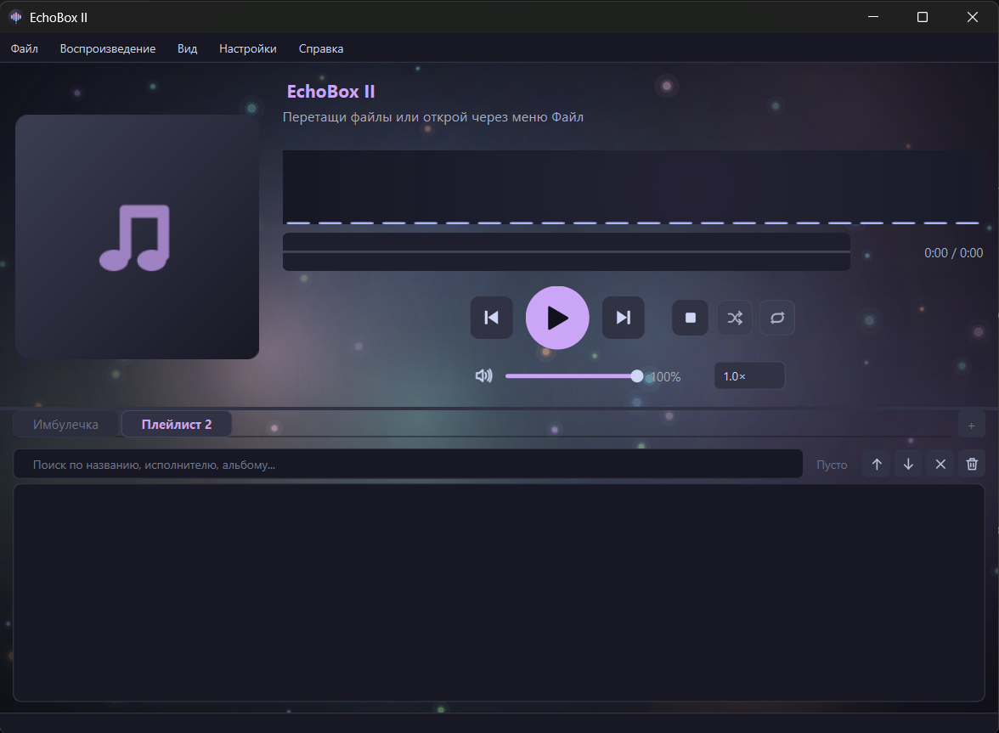
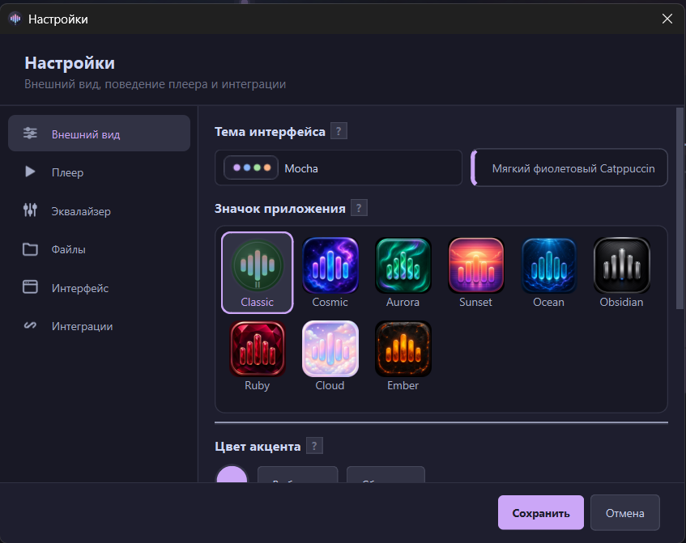
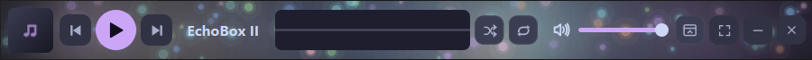
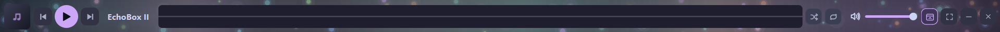

# EchoBox II

EchoBox II — музыкальный плеер для Windows. Он воспроизводит локальные аудио- и видеофайлы, умеет добавлять музыку по ссылкам и сохраняет плейлисты между запусками.

## Скриншоты

### Главное окно



### Настройки



### Мини-плеер



### Мини-плеер во всю ширину экрана



## Скачать

Готовые сборки находятся на странице [Releases](../../releases/latest).

Там публикуются два варианта:

- `EchoBoxII-Setup-x.x.x.exe` — обычный установщик;
- `EchoBox-II-x.x.x-portable.zip` — версия без установки.

Приложение рассчитано на 64-битные Windows 10 и Windows 11. Qt, yt-dlp и остальные необходимые файлы уже находятся внутри сборки.

## Что умеет плеер

- воспроизводит локальные аудио- и видеофайлы;
- добавляет треки по ссылкам через yt-dlp;
- создаёт несколько плейлистов и работает с M3U/M3U8;
- ищет треки по названию, исполнителю и альбому;
- сканирует выбранную папку с музыкой;
- показывает осциллограмму и визуализатор;
- поддерживает повтор, перемешивание, изменение скорости и кроссфейд;
- запоминает позицию воспроизведения;
- имеет эквалайзер для локальных аудиофайлов;
- показывает текущий трек через Discord Rich Presence;
- работает в обычном и компактном режимах;
- позволяет менять тему, акцентный цвет, шрифт и значок приложения;
- проверяет наличие новых версий и устанавливает обновления.

Скачанные по ссылкам треки сохраняются в кэше. Его размер и очистка доступны в настройках.

## Проверка загруженных файлов

Обновлятор принимает файлы только из Releases этого репозитория. Перед установкой он проверяет имя файла, размер и SHA-256, полученные через GitHub API. При несовпадении обновление не запускается.

В каждом новом релизе есть файл `SHA256SUMS.txt`. Проверить установщик в PowerShell можно так:

```powershell
Get-FileHash .\EchoBoxII-Setup-x.x.x.exe -Algorithm SHA256
```

Полученный хеш должен совпасть со значением в `SHA256SUMS.txt`.

Происхождение сборки также можно проверить через GitHub CLI:

```powershell
gh attestation verify EchoBoxII-Setup-x.x.x.exe -R BANANCHIKIREAL/EchoBox-II
```

Если файл был изменён после сборки, проверка не пройдёт.

Сообщить об уязвимости можно через [Security Advisories](../../security/advisories/new). Не публикуйте сведения об уязвимости в обычном Issue до исправления.

## Добавление музыки по ссылке

Откройте «Файл → Открыть по ссылке» или нажмите `Ctrl+U`, затем вставьте адрес страницы с треком. Ссылку также можно перетащить прямо в окно приложения.

Для сайтов, которым требуется вход в аккаунт, в настройках можно выбрать браузер, из которого yt-dlp получит cookies.

## Горячие клавиши

| Клавиша | Действие |
|---|---|
| `Space` | Воспроизведение или пауза |
| `←` / `→` | Перемотка |
| `Shift+←` / `Shift+→` | Перемотка крупным шагом |
| `Ctrl+←` / `Ctrl+→` | Предыдущий или следующий трек |
| `↑` / `↓` | Изменение громкости |
| `M` | Выключение или включение звука |
| `S` | Остановка |
| `F11` | Компактный плеер |
| `Delete` | Удаление выбранного трека |
| `Ctrl+F` | Поиск |
| `Ctrl+A` | Выделение всех треков |
| `Ctrl+O` | Открытие файлов |
| `Ctrl+U` | Открытие ссылки |
| `Ctrl+S` | Сохранение плейлиста |
| `Ctrl+L` | Загрузка плейлиста |
| `Ctrl+Q` | Выход |

Шаг перемотки и изменения громкости настраивается в приложении.

## Сборка из исходников

Понадобятся CMake 3.16 или новее, Qt 6 с модулями Core, Gui, Widgets, Multimedia, MultimediaWidgets и Network, а также компилятор с поддержкой C++17.

Пример для Qt с MinGW:

```powershell
git clone https://github.com/BANANCHIKIREAL/EchoBox-II.git
cd EchoBox-II
cmake -S . -B build -G Ninja -DCMAKE_PREFIX_PATH="D:/Qt/6.8.3/mingw_64"
cmake --build build
```

Путь к Qt зависит от места установки. Официальные релизы собираются в GitHub Actions; используемая конфигурация находится в [release-windows.yml](.github/workflows/release-windows.yml).

## История изменений

Список опубликованных версий находится на странице [Releases](../../releases).

## Лицензия

Проект распространяется по лицензии MIT с Commons Clause. Исходный код можно использовать, изменять и распространять на условиях файла [LICENSE](LICENSE); продажа проекта и его производных ограничена Commons Clause.
