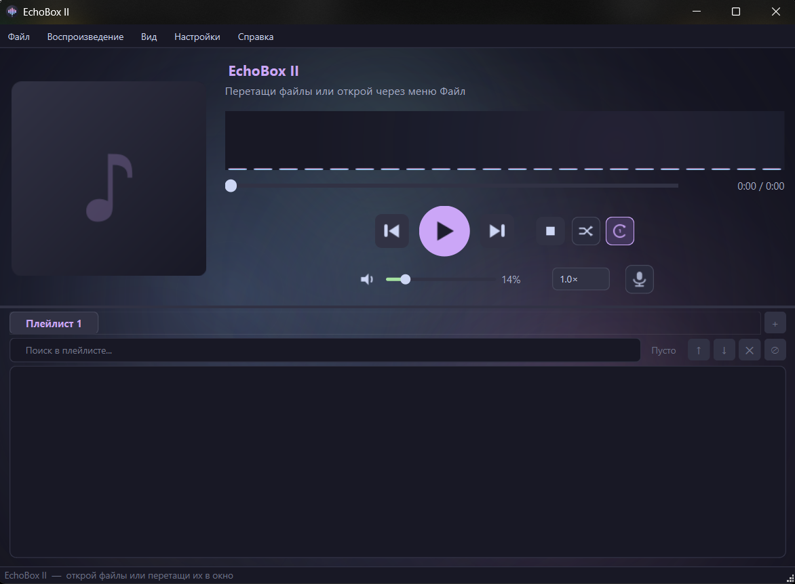

<div align="center">

# 🎵 EchoBox II

**Современный музыкальный плеер для Windows на Qt 6**
Локальные файлы, ссылки на SoundCloud/YouTube/Bandcamp, живой визуализатор и Discord Rich Presence — в одном лёгком и красивом приложении.

[](../../releases/latest)
[](../../releases)
[](https://www.qt.io/)
[](#лицензия)

<p>
  <a href="#-скачать"><b>Скачать</b></a> ·
  <a href="#-возможности"><b>Возможности</b></a> ·
  <a href="#-скриншот"><b>Скриншот</b></a> ·
  <a href="#-сборка-из-исходников"><b>Сборка</b></a> ·
  <a href="#-горячие-клавиши"><b>Горячие клавиши</b></a>
</p>

</div>

<br>

## 📥 Скачать

Заходи на страницу **[Releases](../../releases/latest)** и бери один из двух файлов — всё остальное (Qt, ffmpeg, yt-dlp) уже внутри, доустанавливать ничего не нужно:

|  | Файл | Что это |
|---|---|---|
| 🛠️ | **`EchoBoxII-Setup-x.x.x.exe`** | Установщик — ставится без прав администратора, добавляет ярлыки и пункт в «Установка и удаление программ» |
| 📦 | **`EchoBox-II-vx.x.x-portable.zip`** | Portable-версия — распаковал и запустил, без установки |

Требования: **Windows 10/11 (64-bit)**.

<br>

## ✨ Возможности

### ▶️ Воспроизведение
- Форматы: **MP3, FLAC, WAV, OGG, M4A, AAC, OPUS, WMA, MP4, MKV** и другие аудио/видео
- **Ссылки на музыку** — SoundCloud, YouTube, Bandcamp и сотни других сайтов через встроенный `yt-dlp`, плюс прямые ссылки на аудиофайлы
- Несколько **плейлистов**-вкладок: создание, переименование, удаление, сохранение/загрузка M3U/M3U8
- **Перенос и копирование** треков между плейлистами — правый клик на треке
- Автоматическое **обнаружение дубликатов**
- Повтор (выкл / один трек / весь плейлист), **перемешивание**, скорость 0.5×–2.0×, **кроссфейд**
- Память позиции — продолжает с места остановки

### 🎨 Интерфейс
- **11 полноценных тем**: Mocha, Midnight Neon, Sakura Night, Emerald Forest, Ember Glow, Aurora Borealis, Cyber Violet, Rose Quartz, Arctic Frost, Golden Hour и Crimson Noir
- Единые векторные иконки и тематические логотипы/заглушки обложек, плюс настраиваемый акцентный цвет
- **Осциллограмма** на слайдере перемотки вместо обычной полоски
- Анимированный фон с частицами, реагирующий на музыку
- Плавные анимации по всему приложению — смена трека, кнопки, переходы
- **Мини-плеер** (F11) — компактная безрамочная панель, можно прижать к верху экрана на всю ширину
- Индикатор загрузки с прогресс-баром вместо текста в строке состояния
- Кастомный шрифт интерфейса, три формы обложки альбома
- Системный трей, режим «всегда сверху»

### 📚 Библиотека и поиск
- **Сканер библиотеки** — рекурсивный обход папки в фоновом потоке
- **Умный поиск** одновременно по названию, исполнителю и альбому

### ⚙️ Настройки — тонкая настройка почти всего
- Автозапуск с Windows, запуск свёрнутым в трей
- Автопроверка обновлений — включается/выключается
- Подтверждения удаления — можно отключить лишние диалоги
- Шаг перемотки и шаг громкости — под себя
- Качество аудио при скачивании по ссылке (лучшее / среднее / экономия трафика)
- Кэш скачанных по ссылке треков — размер на диске и очистка одной кнопкой

### 🔌 Интеграции и обновления
- **Discord Rich Presence** — показывает в профиле, что сейчас играет
- Автообновление в один клик — скачивает и переустанавливает новую версию поверх себя
- Куки браузера для yt-dlp — для сайтов, требующих вход
- Drag & Drop файлов, папок и ссылок прямо в окно, список недавних файлов

<br>

## 🖼 Скриншот

<p align="center">
  
</p>

<br>

## 🎧 Ссылка → трек, без лишних действий

Файл → 🔗 **Открыть по ссылке...** (или `Ctrl+U`), вставляешь ссылку — например:

```
https://soundcloud.com/artist/track-name
```

Трек сразу появляется в плейлисте и начинает скачиваться на лету. Ссылку можно и просто перетащить в окно плеера. `yt-dlp` уже встроен в приложение — настраивать ничего не нужно.

<br>

## 🛠 Сборка из исходников

```bash
git clone https://github.com/BANANCHIKIREAL/EchoBox-II.git
cd EchoBox-II

cmake -B build -DCMAKE_PREFIX_PATH="D:/Qt/6.11.1/mingw_64"
cmake --build build
```

Понадобятся: **Qt 6.11 (MinGW 64-bit)**, **CMake 3.16+**. Либо просто открой `CMakeLists.txt` в Qt Creator и нажми Run.

<details>
<summary><b>Структура проекта</b></summary>

```
EchoBox-II/
├── src/
│   ├── main.cpp
│   ├── mainwindow.h / .cpp       — главное окно, вся основная логика
│   ├── settingsdialog.h / .cpp   — диалог настроек
│   ├── visualizer.h / .cpp       — FFT-визуализатор
│   ├── waveformslider.h / .cpp   — осциллограмма на слайдере перемотки
│   ├── backgroundwidget.h / .cpp — анимированный фон с частицами
│   ├── libraryscanner.h / .cpp   — фоновый сканер библиотеки
│   ├── discordrpc.h / .cpp       — Discord Rich Presence
│   ├── icons.h                   — векторные иконки через QPainter (HiDPI)
│   └── logo.h                    — процедурный логотип приложения
├── installer/
│   └── echobox.iss               — сценарий установщика (Inno Setup)
├── assets/
│   ├── app.ico
│   └── preview.png
├── CMakeLists.txt
└── README.md
```

</details>

<br>

## ⌨️ Горячие клавиши

| Клавиша | Действие |
|---|---|
| `Space` | Играть / Пауза |
| `←` / `→` | Перемотка (шаг настраивается в Настройках) |
| `Shift+←` / `Shift+→` | Перемотка крупным шагом |
| `Ctrl+←` / `Ctrl+→` | Предыдущий / Следующий трек |
| `↑` / `↓` | Громкость (шаг настраивается в Настройках) |
| `M` | Вкл. / выкл. звук |
| `S` | Стоп |
| `F11` | Мини-плеер |
| `Delete` | Удалить трек из плейлиста |
| `Ctrl+F` | Фокус на поиск |
| `Ctrl+A` | Выделить все треки |
| `Ctrl+O` | Открыть файлы |
| `Ctrl+U` | Открыть по ссылке |
| `Ctrl+S` | Сохранить плейлист |
| `Ctrl+L` | Загрузить плейлист |
| `Ctrl+Q` | Выход |

<br>

## 📋 Полная история изменений

Список всех версий с описанием изменений — на странице **[Releases](../../releases)**.

<br>

## 📄 Лицензия

MIT + Commons Clause © [BANANCHIKIREAL](https://github.com/BANANCHIKIREAL)

Можно использовать, изменять и распространять. **Продажа запрещена.**
